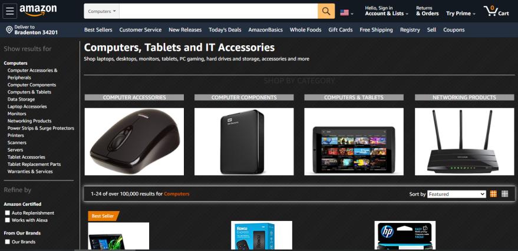

# Amazon-Dark
A dark theme for amazon domains.

# Preview 
A better way and suitable to eyes mode of Amazon webpage.

## Installation
1. Install [Stylus for Firefox](https://addons.mozilla.org/en-US/firefox/addon/styl-us/), [Chrome](https://chrome.google.com/webstore/detail/stylus/clngdbkpkpeebahjckkjfobafhncgmne), [Opera](https://addons.opera.com/en-gb/extensions/details/stylus/) or [Cascadea for Safari](https://cascadea.app/).
2. Install [amazon-dark-theme.user.css](https://raw.githubusercontent.com/abh80/Amazon-Dark/main/amazon-dark-theme.user.css).
